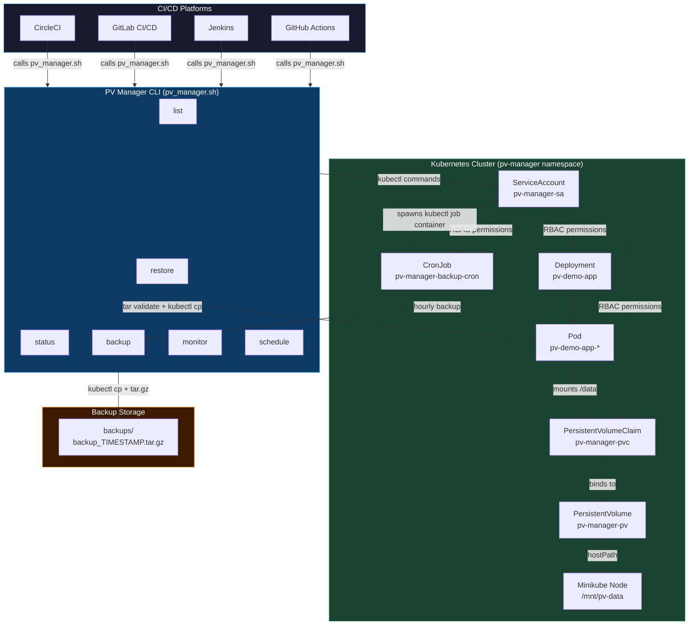

# docs/architecture.md
# System Architecture – Persistent Volume Manager

## Overview

This document describes the architecture of the Persistent Volume Manager system — a DevOps tool for managing, backing up, restoring, and monitoring Kubernetes Persistent Volumes, integrated with multi-platform CI/CD pipelines.

---

## Architecture Diagram



---

## Component Descriptions

### 1. Sample Application (`app/`)
A Python daemon that writes timestamped log entries to `/data/app.log` every 30 seconds. Because `/data` is backed by a PVC, data persists across pod restarts and container crashes — demonstrating the core value of Persistent Volumes.

### 2. Docker Image (`app/Dockerfile`)
Built on `python:3.11-slim` with a non-root user (`appuser`, UID 1001) and a healthcheck that verifies `app.log` exists. Image tag: `pv-demo-app:latest`.

### 3. Kubernetes Layer (`k8s/`)

| Resource | Kind | Description |
|----------|------|-------------|
| `namespace.yaml` | Namespace | `pv-manager` – isolates all resources |
| `rbac.yaml` | ServiceAccount + ClusterRole + Binding | Minimal permissions: list PVs/PVCs, get/exec pods, manage CronJobs |
| `pv.yaml` | PersistentVolume | 1Gi hostPath at `/mnt/pv-data`, `Retain` reclaim policy |
| `pvc.yaml` | PersistentVolumeClaim | Binds explicitly to `pv-manager-pv` |
| `deployment.yaml` | Deployment | Recreate strategy, mounts PVC at `/data`, resource limits, probes |
| `cronjob.yaml` | CronJob | Hourly; `bitnami/kubectl` job container; `concurrencyPolicy: Forbid` |

### 4. PV Manager CLI (`scripts/pv_manager.sh`)
The single source of truth for all storage operations. Key design decisions:

- **Lock file** (`/tmp/pv_manager.lock`) prevents parallel CI/CD runs conflicting
- **Timestamped archives** (`backup_YYYYMMDDTHHMMSSZ.tar.gz`) prevent filename collisions
- **Disk space preflight** checks available KB before writing archives
- **Integrity check** (`tar -tzf`) validates every archive before restore
- **Retry with backoff** for `kubectl cp` network failures (3 attempts, 5s sleep)
- **Colour-coded output** distinguishes info, success, warning, and error messages

### 5. CI/CD Integration (`ci-cd/`)
All four platforms follow the same pattern:

```
Pre-deploy backup → Deploy manifests → Rollout wait → Verify → Monitor → [Restore on failure]
```

| Platform | Key Feature |
|----------|-------------|
| GitHub Actions | 4 separate jobs; backup uploaded as workflow artifact; emergency-restore triggered by `if: failure()` |
| Jenkins | `disableConcurrentBuilds()`; credentials binding; post-failure restore block |
| GitLab CI | `dotenv` artifact passes backup filename between stages; `after_script` handles restore on failure |
| CircleCI | Reusable commands/executors; workspace persistence; `store_artifacts` for backup archives |

---

## Data Flow: Backup

```
CI/CD Pipeline
    │
    ▼
pv_manager.sh backup
    │
    ├─ [check] PVC bound?
    ├─ [check] Pod running?
    ├─ [check] Disk space > 100MB?
    │
    ▼
kubectl cp pv-manager/<pod>:/data → /tmp/pv_backup_<ts>/data
    │
    ▼
tar -czf backups/backup_<ts>.tar.gz
    │
    ▼
tar -tzf ... (integrity check)
    │
    ▼
rm -rf /tmp/pv_backup_<ts>     (cleanup staging)
    │
    ▼
SUCCESS → release lock
```

## Data Flow: Restore

```
pv_manager.sh restore backups/backup_<ts>.tar.gz
    │
    ├─ [check] Archive exists?
    ├─ [check] tar -tzf (integrity)?
    ├─ [check] PVC bound?
    ├─ [check] Pod running?
    │
    ▼
tar -xzf → /tmp/pv_restore_<ts>/data
    │
    ▼
kubectl cp /tmp/.../data/. → pv-manager/<pod>:/data
    │
    ▼
rm -rf /tmp/pv_restore_<ts>
    │
    ▼
SUCCESS → release lock
```

---

## Error Handling Matrix

| Scenario | Detection | Response |
|----------|-----------|----------|
| PVC not bound | `kubectl get pvc` status check | Exit 2 with descriptive message |
| Pod not running | `field-selector=status.phase=Running` | Exit 2 with diagnostic hints |
| Backup file exists | Pre-write existence check | Exit 1 (timestamps prevent this normally) |
| Corrupted backup | `tar -tzf` integrity check | Remove corrupt file, exit 3 |
| Insufficient disk space | `df -k` preflight | Exit 1 with available/required sizes |
| Network failure during cp | Retry 3×, 5s sleep | Die with attempt count after max retries |
| Parallel pipeline conflict | Lock file + PID validation | Exit 1, stale locks auto-cleaned |
| Cluster unreachable | `kubectl cluster-info` preflight | Exit 1 before any operations |

---

## Prerequisites

| Tool | Version | Purpose |
|------|---------|---------|
| Minikube | ≥ 1.30 | Local Kubernetes cluster |
| kubectl | ≥ 1.28 | Cluster interaction |
| Docker | ≥ 24.0 | Image build |
| Bash | ≥ 4.0 | PV Manager script |
| metrics-server | any | `kubectl top` (enable via `minikube addons enable metrics-server`) |
